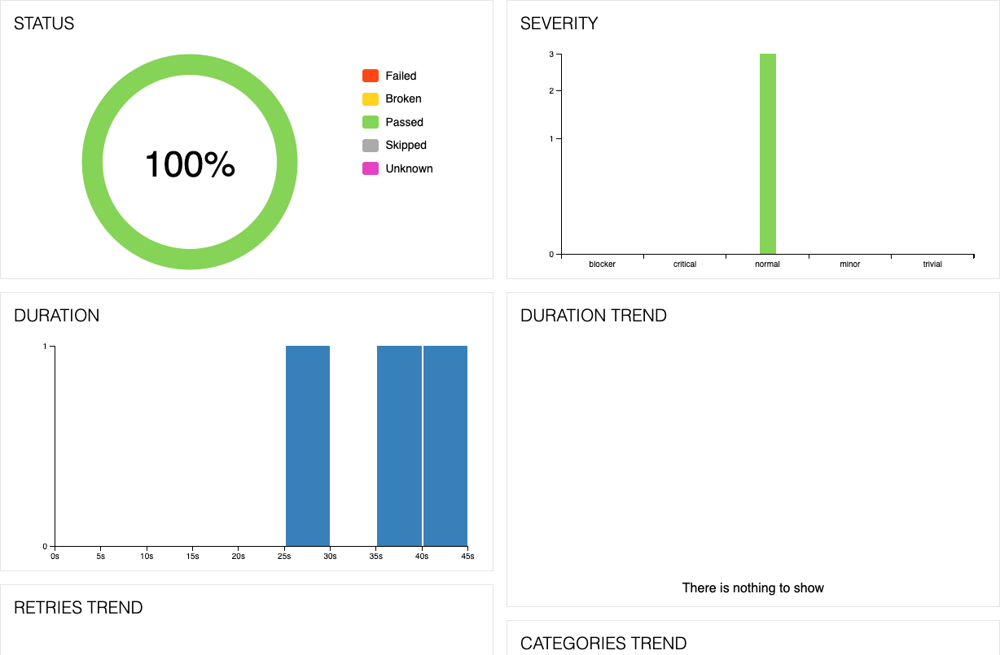

## Score QA Automation Challenge
This is an automation solution that finds a league, team, or player within theScore app and verify the specified steps.

------------------------------------------------------

#### Author: Gurchet Singh
#### Email: sgurchet20@gmail.com

### Description
This framework is to provide automation solution to the given problem where the business flows of theScore is to be automated. To provide the cross-platform solution, appium tool is identified. Appium has capability to interact with devices having different plaforms and using same client side source code. To provide behavioral approach cucumber is used. It provided better re-usability and simplicity. Page object model is identified according to the requirement where inheritance based hierarchy built for page objects. On demand page object loading for the generic usage in business flows.  

### Technical dependencies
    * Maven 3.9.3
    * JDK 11
    * Node 20.3.1
    * Appium 2.2.3
    * UIAutomator2
    * Allure 2.23.0
    * android-platform-tools
    * Connected mobile device or virtual device

### Prerequisites
- [x] Clone the repository
- [x] The application under test can be found in resources folder
- [x] Connect the device or start virtual device
- [x] Install the app on device or virtual device
- [x] Set the device capabilities in capabilities.json under resources folder
- [x] Set config.properties according to the requirement(You can also pass the same from maven)
- [x] Run the appium server at 4723 port
- [x] Run maven command "clean install -Dtest=TestRunner -Dcucumber.filter.tags=@VerifyBackNavigation -Dappium_host=127.0.0.1 -Dappium_port_number=4723 -Dappium_auto_run=false -Dinstall_app=false -Dplatform=ANDROID -Dapp_path={} -Ddevice_name={}"
- [x] After run, allure report should get auto launched

### Salient Features
* Behaviour driven features
* Auto appium server run
* Auto app install
* Allure reporting

### Test Report

